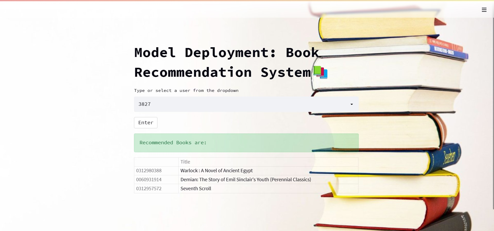
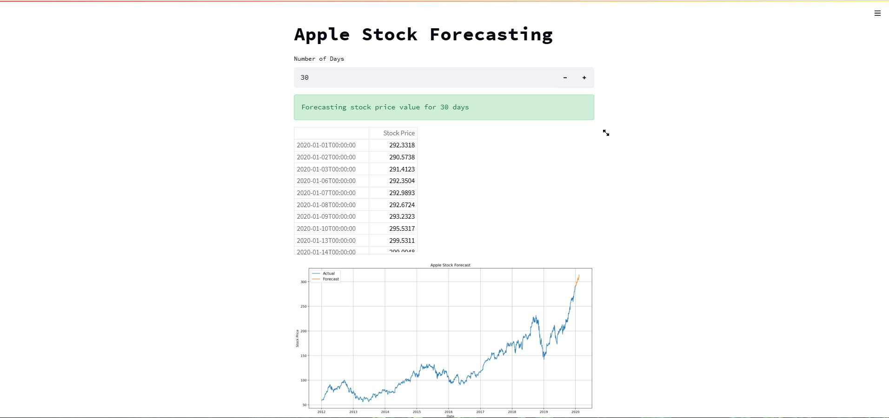

# Data Scientist
 
> Technical Skills: Python, SQL, Power BI, Tableau, Excel

## Education
- M.Sc Statistics | Department of Statistical Sciences
                     Kannur University (Apr 2021)
- B.Sc Mathematics | Sree Narayana College Kannur (Apr 2019)

***

## Work Experience

**Data Science Trainer @ IPCS Global Kannur (January 2024 - Present)**
- **Comprehensive Training Programs:** Delivered in-depth data science training to corporate clients and individuals, covering essential topics such as Python, R, machine learning, and data visualization. Designed and updated course materials, incorporating real-world case studies and practical coding exercises to enhance learning outcomes.

- **Project and Student Support:** Provided extensive support for training projects within the department and branch, ensuring successful program execution. Conducted frequent student assessments, gathered feedback, and reported findings to higher management to continuously improve training effectiveness. Built strong relationships with students to foster a positive learning environment.

  
- **Event and Workshop Coordination:** Organized and led technical training programs, career enhancement seminars, and workshops at colleges and training centers. Acted as a key figure in various company-organized training programs, enhancing student engagement and learning experiences.

  
- **Marketing and Content Creation:** Contributed to marketing activities by providing inputs and maintaining competitor updates. Engaged in blogging and supported various programs as advised by management to promote the training division and attract new candidates.

**Data Science Intern @ Ai variant (June 2022 - February 2023)**
- **Project Participation:** Contributed to two data science projects, involving data collection, cleaning, and preprocessing.

  
- **Analysis and Modeling:** Assisted in developing machine learning models, performing statistical analyses, and interpreting results.

  
- **Reporting:** Prepared reports and visualizations to communicate findings and insights to the project team and stakeholders.
  

***

## Project 1: Book Recommendation System
Developed a sophisticated book recommendation system aimed at providing personalized reading suggestions based on user preferences. Using Python, I meticulously curated a dataset by selecting books rated by a substantial user base of at least 100 readers, focusing on users who had rated a minimum of 50 books to ensure robust interaction data. The dataset was structured into a pivot table format, with users as rows and books as columns, and missing values were strategically filled with zeros to facilitate accurate similarity calculations.

To enhance recommendation accuracy, I employed cosine similarity to construct a user-user similarity matrix, enabling the system to identify and match users with similar reading tastes. The recommendation engine utilizes these insights to suggest top-rated books aligned with the preferences of comparable users, thereby enriching the reading experience through tailored recommendations.

For seamless accessibility, the model was deployed using Streamlit, incorporating a user-friendly interface where individuals can effortlessly select their profile and explore curated book recommendations. The interface was further enriched with visual elements such as background images to ensure an engaging user experience.

This project underscores the application of advanced data analytics to deliver effective and personalized book recommendations, enhancing user satisfaction and engagement in literary pursuits.

## Project 2: Apple Stock Price Forecasting
Implemented an advanced time series forecasting model to predict Apple Inc.'s stock prices. The project involved rigorous data preprocessing and evaluation of various modeling techniques, including ARIMA, SARIMA, and Holt-Winters exponential smoothing. The SARIMA model was selected for its robust capability in capturing seasonal trends. Utilizing Streamlit for deployment, the interface allows users to input their desired forecasting periods and visualize predicted stock prices alongside historical data. This project exemplifies the application of sophisticated time series analysis for accurate financial forecasting.

